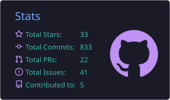
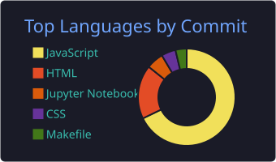
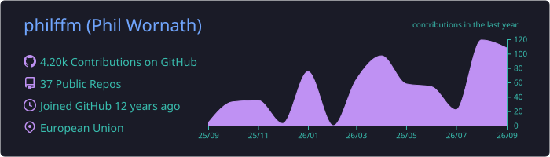

# Hi there, I'm Phil! 👋 

  

I'm a developer and UX enthusiast based in the **European Union**, passionate about building tools that bridge the gap between AI and everyday productivity.

---

### 🚀 What I'm working on
I enjoy building lean, functional tools—mostly centered around AI integration and knowledge management:

- 🤖 **[ai-summary-helper](https://github.com/philffm/ai-summary-helper)**: A browser tool to fetch and insert AI-generated summaries of web content (OpenAI/Mistral support).

---

### 🛠️ My Tech Stack

  

---

### 📊 GitHub Stats

  
  

  

---

### 📫 Find me online
- **Website:** [link.philwornath.com](https://link.philwornath.com)
- **Mastodon:** [@phw@mastodon.online](https://mastodon.online/@phw)

---

  <i>"Always curious about the intersection of design and code."</i> 
  Credits to the 🦝 for the profile vibes.

